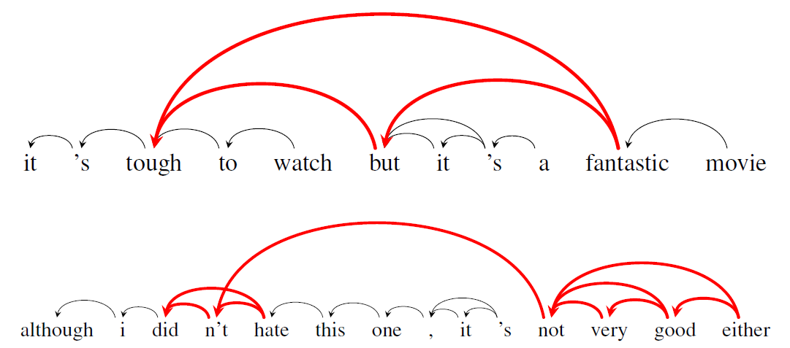
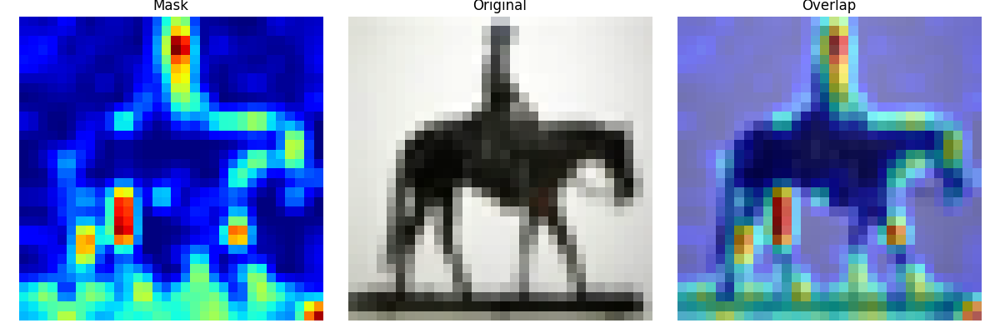
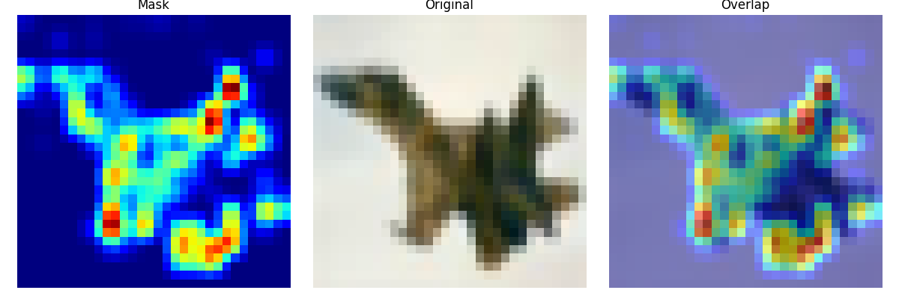
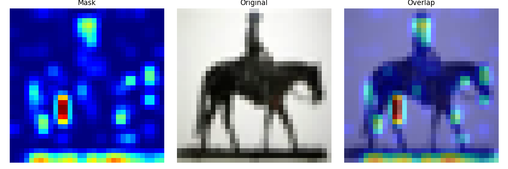
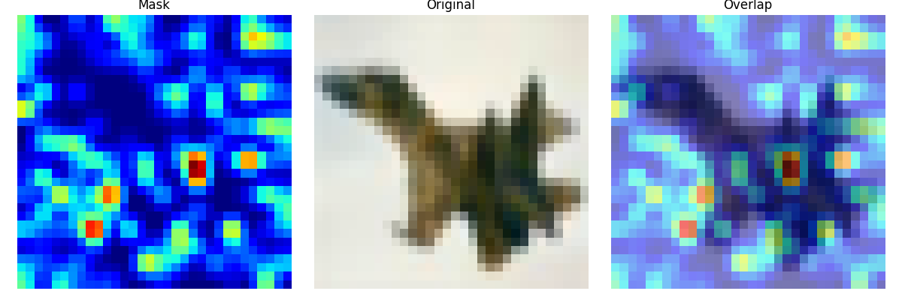

# Attention Benchmark (Use-case Provenance Blockchain)

This is the initial codebase for the provenance blockchain use-case. 
In `src` are saved all scripts to pretrain and finetune the vision transformers with different attention modules. 
The workflow contains, other than the pretraining and finetuning steps, also data elaboration and analysis on the respective provenance json files. 

What we care about is integrating in yProv4ML a system to be able to track [proof of learning](), as well as add an automated way to upload the data to the blockchain.  

## Use case in detail
The mechanism under examination, attention, is the main component in modern deep learning (and transformers) architectures. 
It enables models to dynamically focus on the most relevant portions of the input when making predictions. 
It accomplishes this by assigning different weights to input elements based on their contextual importance. 
This allows the model to efficiently filter and amplify the most relevant information. 
This dynamic weighting process facilitates better interpretability and enhances overall model performance by linking semantically related elements, regardless of their position in the input sequence.
In transformer-based architectures, attention plays a critical role in establishing long-range dependencies and capturing global context. 

It is however well known that attention, since it tries to link importance between one word and all others, scales poorly with the length of the phrase inserted in the ML model. 
As sequence lengths increase, the quadratic time and memory complexity of self-attention becomes a significant challenge. 
Exploring alternatives or improvements to the standard attention mechanism is not only of theoretical interest, but also a practical necessity for improving scalability and efficiency.

#### What we want to check
To investigate this, we propose using a simplified, custom Vision Transformer (ViT) implementation as an experimental framework. 
This controlled setup will enable us to develop and test a modular system with interchangeable attention mechanisms. 
These custom attention modules can be plugged into and out of the ViT architecture, enabling direct and fair comparisons across different designs.
Our primary goal is to benchmark their effectiveness and efficiency across multiple dimensions.

The evaluation will include quantitative metrics such as memory usage, GPU utilization, and computation time. 
We will track these metrics during the pretraining and fine-tuning phases to observe the impact of different attention mechanisms on convergence rates, final loss values, and overall training stability. 
In addition to numerical performance, we will visually inspect the attention maps produced by each module to gain qualitative insights. 
This will help us understand how the modules perceive and prioritize features within input images. 
This process may reveal deeper behavioral differences that aren’t immediately apparent through loss curves or accuracy scores alone.

|  |  |
|-----------------|-----------------|
|  |  |
